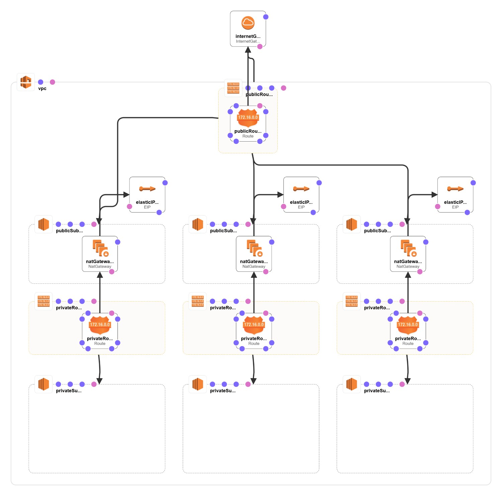

== Cloudformation
Cloudformation templates and scripts.

== Network architecture ==
The network template assumes a region with three availability zones. It will deploy itself into any VPC. The following visualization assumes, that this network is the only structure inside the VPC.

